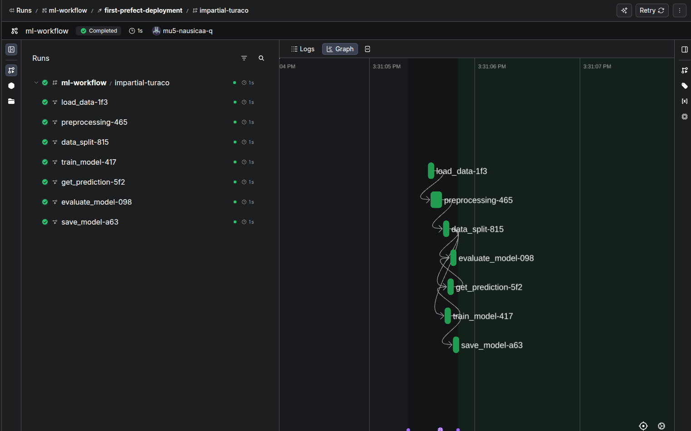

# Prefect ML Workflow - Bank Churn Prediction

Automated ML pipeline using Prefect for bank customer churn prediction.

## 📊 Pipeline Visualization



**Tasks**: Load data → Preprocess → Split → Train → Predict → Evaluate → Save model

## 🚀 Quick Start
```bash
# Install dependencies
pip install -r requirements.txt

# Run locally
python main.py
```

## 📅 Deploy & Automate
```bash
# 1. Create work pool
prefect work-pool create wf-work-pool --type process

# 2. Deploy
python deployment.py

# 3. Start worker (Terminal 1)
prefect worker start --pool wf-work-pool

# 4. Trigger run (Terminal 2)
prefect deployment run 'ml-workflow/first-prefect-deployment'
```

## 🖥️ View UI
```bash
prefect server start
# Open http://127.0.0.1:4200
```

## 📈 Results

- **Accuracy**: ~81-84%
- **F1 Score**: ~0.64

## ⏰ Schedule Runs

Add schedule in UI → Deployments → Add Schedule → Cron: `0 3 * * *` (daily at 3 AM)

